# Configuração do Oracle AI Data Platform

## 🎯 **Objetivos**

Neste laboratório, você vai aprender a **configurar uma sessão no Oracle AI Data Plataform**

### _**Aproveite sua experiência na Oracle Cloud!**_

## 📌 Introdução

### ➡️ **O que é o AIDP?**

<br>
O AIDP (AI Data Platform) é a plataforma unificada da Oracle para ingestão, preparação e governança de dados, integrando pipelines de data lakehouse com catálogos centralizados.

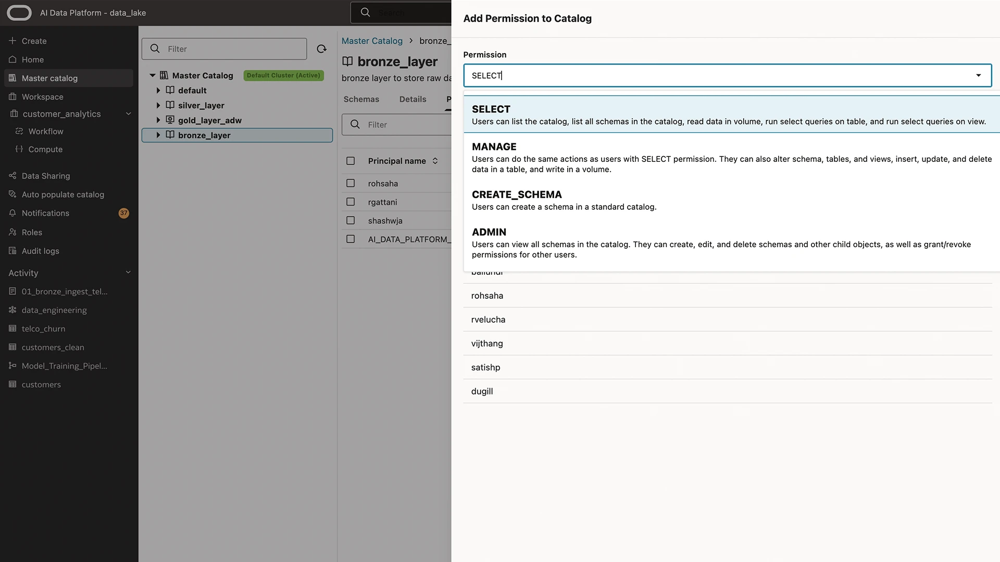

Ele oferece notebooks interativos para exploração de dados e colaboração entre equipes técnicas e de negócio.

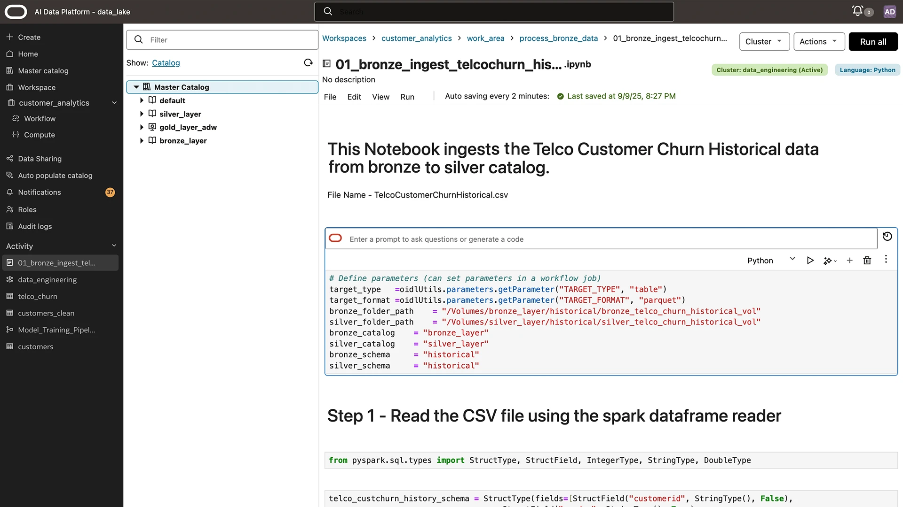

Além disso, possui orquestração visual e automação para gerenciar fluxos de ponta a ponta com qualidade, segurança e transparência.

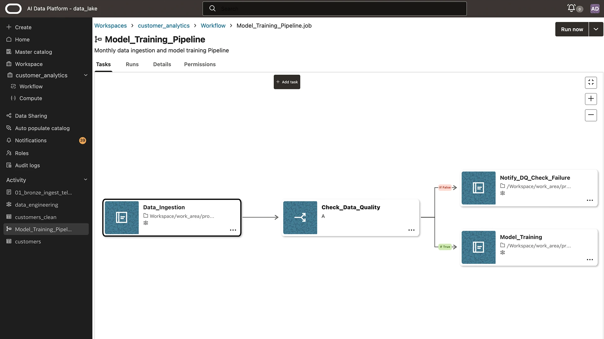

## 1️⃣ Criação do AIDP

> **ATENÇÃO:** Durante a criação do serviço, as políticas de acesso são configuradas automatixamente. **Se seu usuário da cloud não possui permissão para criação de políticas, é necessário que as etapas abaixo sejam realizadas por um administrador da conta.**

Clique no menu **(☰)** e selecione **Analytics & AI ⮕ AI Data Platform**.

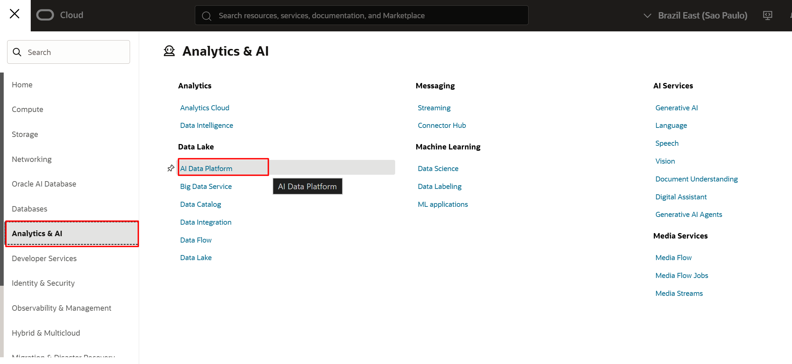

> **VERIFIQUE SE O COMPARTIMENTO DE CRIAÇÃO DO SERVIÇO ESTÁ CORRETO. O COMPARTIMENTO ESTÁ LISTADO NA REGIÃO ESQUERDA DA TELA. O RECOMENDADO É REALIZAR A CRIAÇÃO DO SERVIÇO FORA DO COMPARTIMENTO ROOT.**

Clique em **Create AI Data Plataform**.

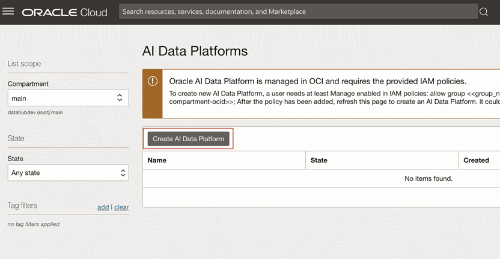

Para criar uma instância do AI Data Platform informe o nome da plataforma e do workspace inicial.

 - **NOME PLATAFORMA: aidp-livelabs** 
 - **NOME WORKSPACE: aidp-livelabs**

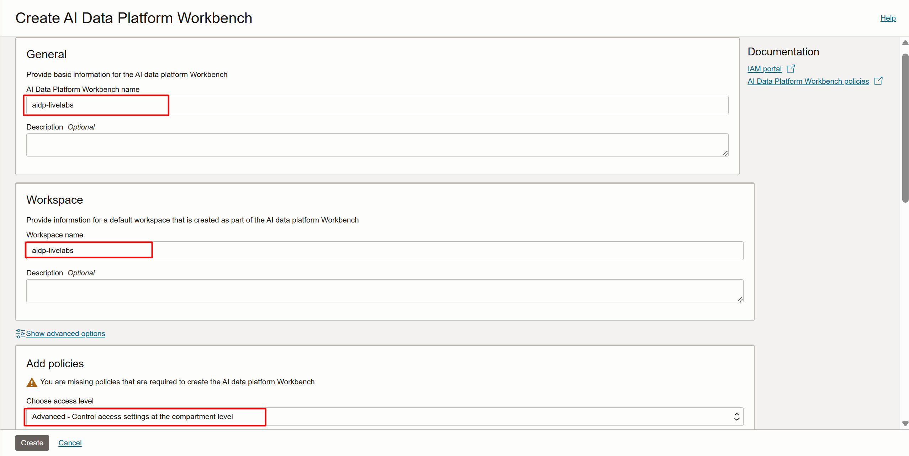

Escolha o nível de acesso (políticas) indicado abaixo - ADVANCED - clique em **Add** nos pontos indicados na imagem e clique em **Create**.

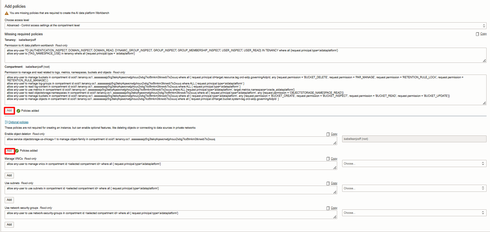

Após a criação, você terá a instância provisionada em seu ambiente. Clique no ícone indicado para abrir o AI Data Plataform.

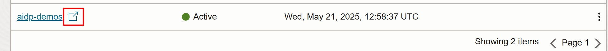

Caso tenha chegado até aqui, você pode seguir para o próximo laboratório.

## [SIGA SOMENTE SE ETAPA ANTERIOR NÃO FUNCIONAR] Criação de Grupo e Tenancy OCID

Para adicionar as políticas manualmente siga os passos abaixo.

Para isso, precisaremos de duas informações: **OCID do compartimento onde o AIDP será criado e o nome do grupo de usuários que terá acesso a este ambiente.**

O primeiro passo é a criação de um grupo. Este será o grupo de usuários terá acesso ao ambiente de desenvolvimento.

Clique no menu **(☰)** e selecione **Identity & Security ⮕ Domains**

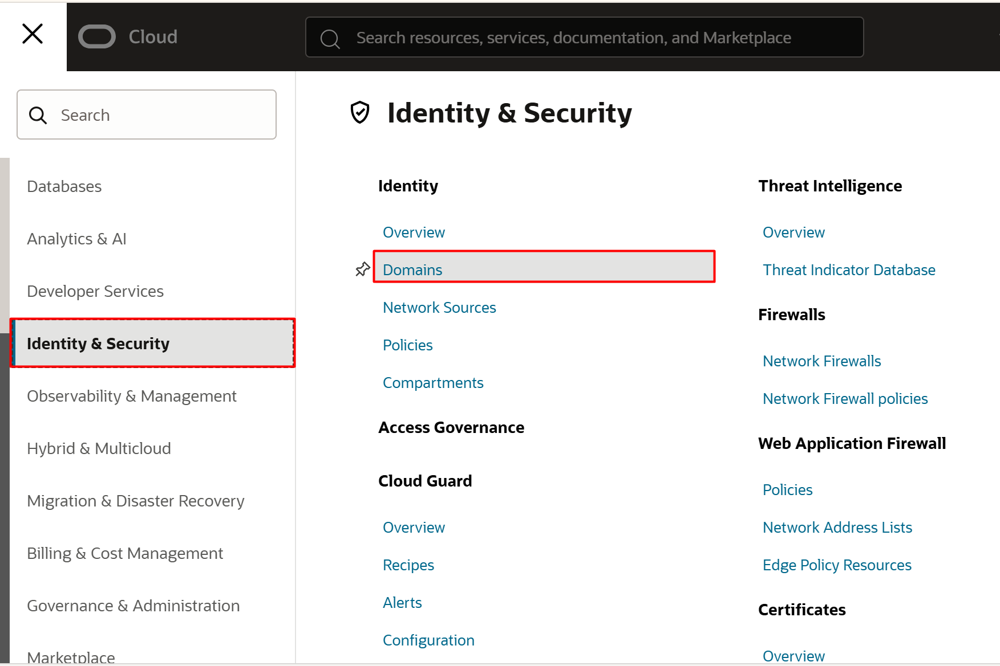

Escolha o compartimento **root** e clique no Domain **Default** que aparecerá na página.


Em seguida, clique em **User Management**, desça a página do navegador até encontrar **Groups** e clique em **Create Group**

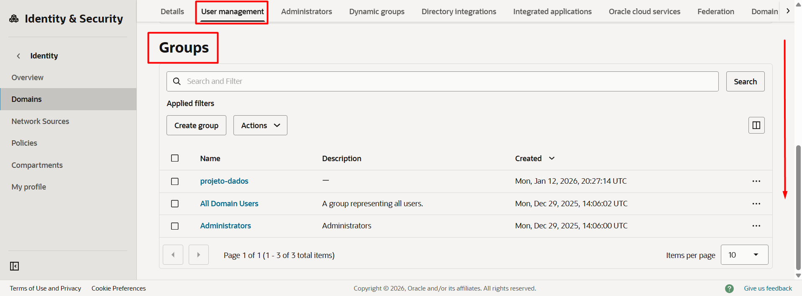

Adicione o nome do grupo e os usuários que terão acesso ao ambiente e clique em **Create**.

- **Nome Grupo:** projeto-dados

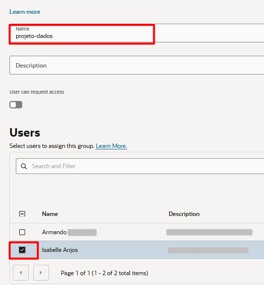

Agora vamos buscar a informação do Compartment ID. Clique no menu **(☰)** e selecione **Identity & Security ⮕ Compartments**

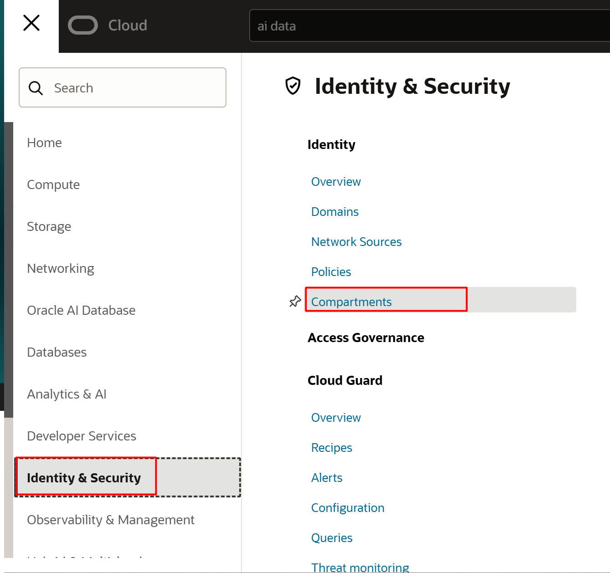

Clique no nome do compartimento. 

> **ATENÇÃO:** SEU COMPARTIMENTO PODE POSSUIR UM NOME DIFERENTE DO INDICADO NA IMAGEM.

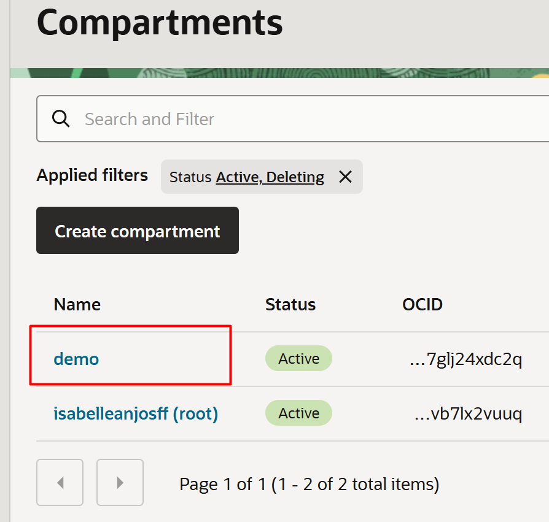

Copie a informação do **OCID do compartimento** e salve em algum documento.

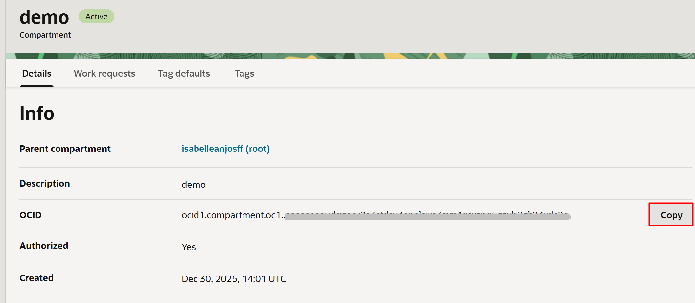

## [SOMENTE SE ETAPA ANTERIOR NÃO FUNCIONAR] Configuração de Políticas

Clique no menu **(☰)** e selecione **Identity & Security ⮕ Policies**

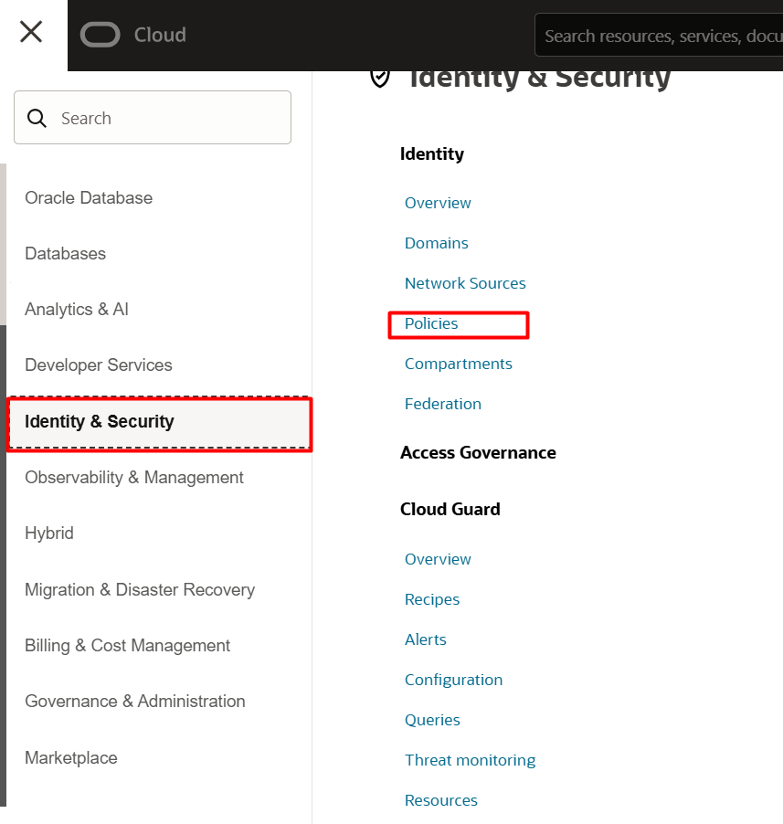

Clique em **Create Policy**. 
> **ATENÇÃO:** Selecione o **Compartment** com nome de ```<NomeTenancy>(root)```
<br> 
  
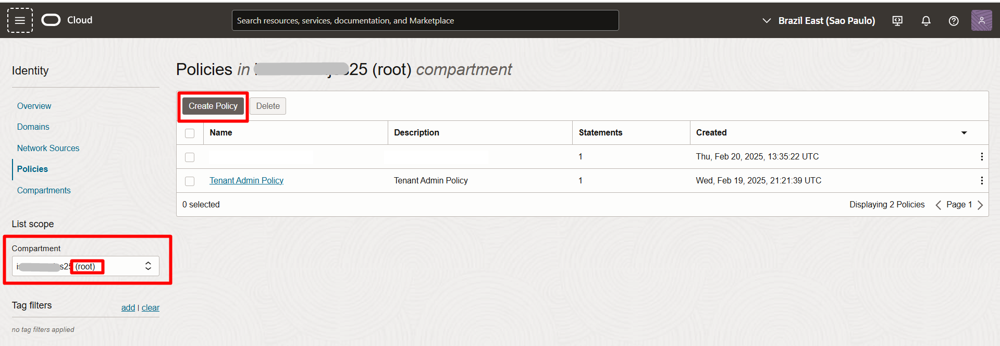

Escolha o **Compartment**: ```<NomeTenancy>(root)```. Em seguida, dê um nome e uma descrição.
 - **NOME: policies-aidp** 
 - **DESCRIÇÃO: Políticas para AI Data Plataform**


Selecione **Show Manual Editor** e adicione as frases abaixo, substituindo os valores <aidpAdminGroup> e <aidpCompartmentId> pelos conteúdos obtidos na etapa anterior. Em seguida, clique em **Create**.

    <copy>  
    allow any-user to manage buckets in compartment id <aidpCompartmentId> where all { request.principal.id=target.resource.tag.orcl-aidp.governingAidpId, any {request.permission = 'BUCKET_DELETE', request.permission = 'PAR_MANAGE', request.permission = 'RETENTION_RULE_LOCK', request.permission = 'RETENTION_RULE_MANAGE'} }

    allow any-user to manage log-groups in compartment id <aidpCompartmentId> where ALL { request.principal.type='aidataplatform' }

    allow any-user to read log-content in compartment id <aidpCompartmentId> where ALL { request.principal.type='aidataplatform' }

    allow any-user to use metrics in compartment id <aidpCompartmentId> where ALL { request.principal.type='aidataplatform', target.metrics.namespace='oracle_aidataplatform' }

    allow any-user to read objectstorage-namespaces in compartment id <aidpCompartmentId> where all { request.principal.type='aidataplatform', any {request.permission = 'OBJECTSTORAGE_NAMESPACE_READ'} }

    allow any-user to manage buckets in compartment id <aidpCompartmentId> where all { request.principal.type='aidataplatform', any {request.permission = 'BUCKET_CREATE', request.permission = 'BUCKET_INSPECT', request.permission = 'BUCKET_READ', request.permission = 'BUCKET_UPDATE'} }

    allow any-user to manage objects in compartment id <aidpCompartmentId> where all { request.principal.id=target.bucket.system-tag.orcl-aidp.governingAidpId }
    </copy>  

<!-- Separador -->
> **ATENÇÃO:** É necessário ajustar o conteúdo da policy com as informações obtidas na primeira etapa: OCID do compartimento onde o AIDP está no local de ```<aidpCompartmentId>``` e nome do grupo no local de ```<aidpAdminGroup>```.

## Conclusão

Nesta laboratório, você aprendeu como realizar a criação das políticas e dos recursos que iremos utilizar no desenvolvimento da arquitetura medalhão nos próximos laboratórios.

## Autoria

- *Created By/Date* - Armando Neto, Isabelle Anjos, Janeiro 2026
- *Last Updated By* - Isabelle Anjos, Janeiro 2026