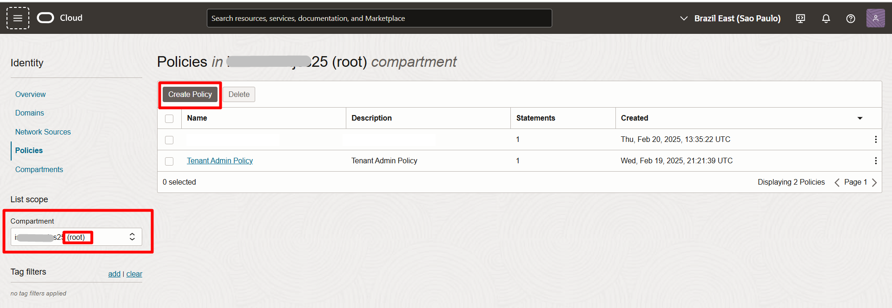

# Configuração do Oracle AI Data Platform

# 🎯 **Objetivos**

Neste laboratório, você vai aprender a **configurar uma sessão no Oracle AI Data Plataform**

### _**Aproveite sua experiência na Oracle Cloud!**_

## 📌 Introdução

### ➡️ **O que é o AIDP?**

## 1️⃣ Configuração de Políticas

Antes de criar o ambiente de código, vamos configurar as permissões necessárias para a interação entre os serviços.

1. Clique no menu **(☰)** e selecione **Identity & Security ⮕ Policies**


2. Clique em **Create Policy**. 
> **ATENÇÃO:** Selecione o **Compartment** com nome de ```<NomeTenancy>(root)```
<br> 
  


3. Escolha o **Compartment**: <<'NomeTenancy'>>**root**. Em seguida, dê um nome e uma descrição.
 - **NOME: policies-aidp** 
 - **DESCRIÇÃO: Políticas para AI Data Plataform**


4.Selecione **Show Manual Editor** e adicione a frase abaixo. Copie e cole a frase exatamente como está abaixo. Em seguida, clique em **Create**.

    <copy>  
    allow group <aidpAdminIdentityDomain>/<aidpAdminGroup> to manage ai-data-platforms in compartment id <aidpCompartmentId>
    allow any-user TO {AUTHENTICATION_INSPECT, DOMAIN_INSPECT, DOMAIN_READ, DYNAMIC_GROUP_INSPECT, GROUP_INSPECT, GROUP_MEMBERSHIP_INSPECT, USER_INSPECT, USER_READ} IN TENANCY where all {request.principal.type='aidataplatform'}
    allow any-user to manage log-groups in compartment id <aidpCompartmentId> where ALL { request.principal.type='aidataplatform' }
    allow any-user to read log-content in compartment id <aidpCompartmentId> where ALL { request.principal.type='aidataplatform' }
    allow any-user to use metrics in compartment id <aidpCompartmentId> where ALL {request.principal.type='aidataplatform', target.metrics.namespace='oracle_aidataplatform'}
    allow any-user to manage buckets in tenancy where all { request.principal.type='aidataplatform', any {request.permission = 'BUCKET_CREATE', request.permission = 'BUCKET_INSPECT', request.permission = 'BUCKET_READ', request.permission = 'BUCKET_UPDATE'}}
    allow any-user to {TAG_NAMESPACE_USE} in tenancy where all {request.principal.type = 'aidataplatform'}
    allow any-user to manage objects in tenancy where all { request.principal.id=target.bucket.system-tag.orcl-aidp.governingAidpId  }
    allow any-user to {TAG_NAMESPACE_USE} in tenancy where all {request.principal.type = 'aidataplatform'}
    allow any-user to manage objects in tenancy where all { request.principal.id=target.bucket.system-tag.orcl-aidp.governingAidpId  }

    </copy>  

<!-- Separador -->
> **ATENÇÃO:** Não é necessário ajustar o conteúdo da policy, mantenha a frase como indicado acima.


## 2️⃣ Criação do AIDP
Clique no menu **(☰)** e selecione **Analytics & AI ⮕ AI Data Platform**.


## Conclusão

Nesta laboratório, você aprendeu como realizar a criação das políticas e dos recursos que iremos utilizar no desenvolvimento da arquitetura medalhão nos próximos laboratórios..

## Autoria

- *Created By/Date* - Thais Henrique, Heloisa Escobar, Isabelle Anjos, Janeiro 2024
- *Last Updated By* - Isabelle Anjos, Outubro 2025