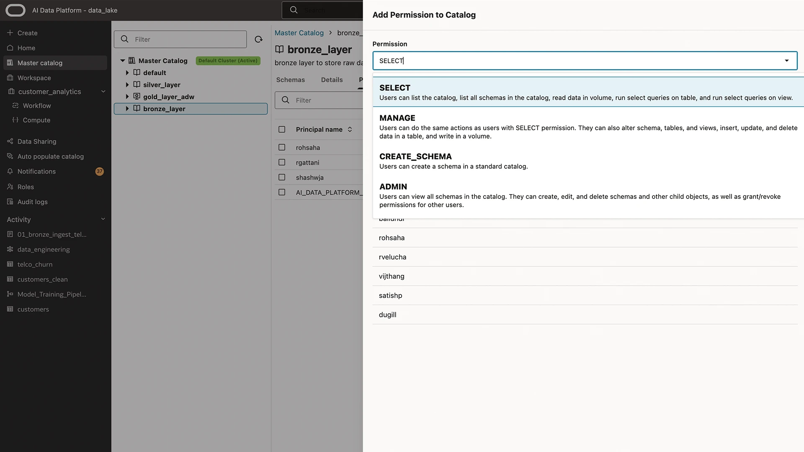
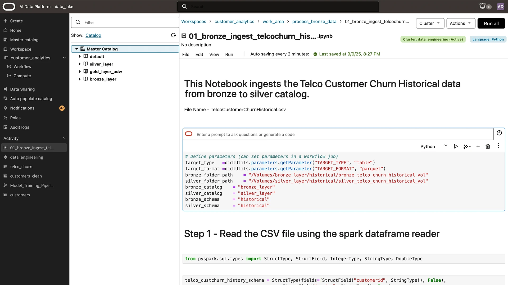
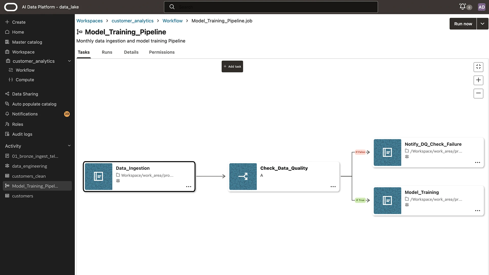
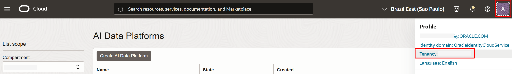
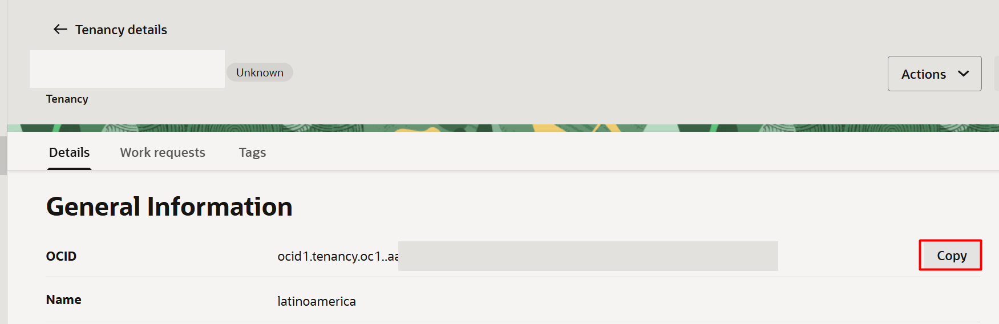
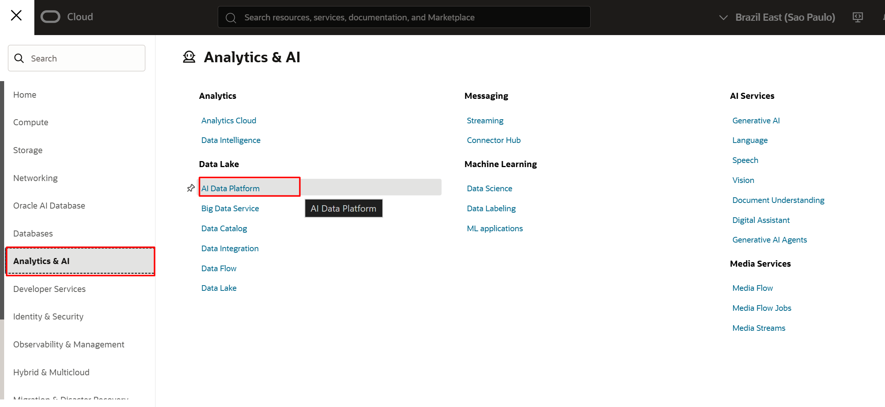
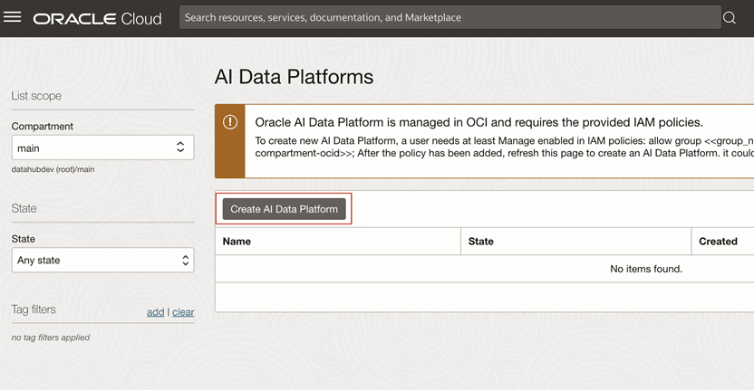
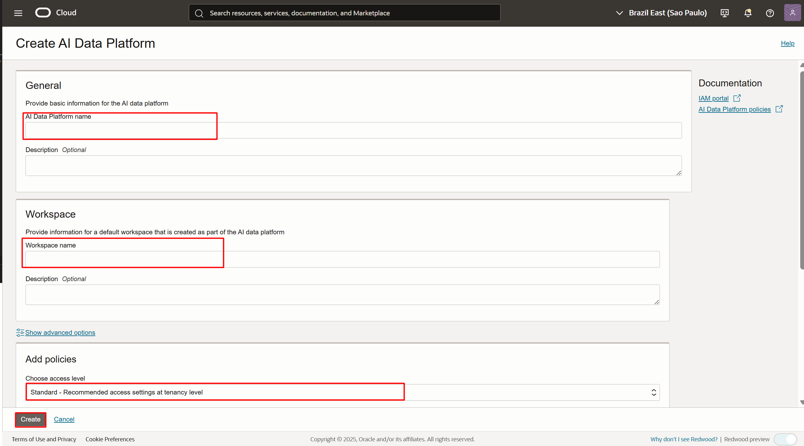

# Configuração do Oracle AI Data Platform

## 🎯 **Objetivos**

Neste laboratório, você vai aprender a **configurar uma sessão no Oracle AI Data Plataform**

### _**Aproveite sua experiência na Oracle Cloud!**_

## 📌 Introdução

### ➡️ **O que é o AIDP?**

<br>
O AIDP (AI Data Platform) é a plataforma unificada da Oracle para ingestão, preparação e governança de dados, integrando pipelines de data lakehouse com catálogos centralizados.



Ele oferece notebooks interativos para exploração de dados e colaboração entre equipes técnicas e de negócio.



Além disso, possui orquestração visual e automação para gerenciar fluxos de ponta a ponta com qualidade, segurança e transparência.



## 1️⃣ Configuração de Políticas

Antes de criar o ambiente de código, vamos configurar as permissões necessárias para a interação entre os serviços.

Para isso, precisaremos de duas informações: **OCID da tenancy e nome do grupo que criaremos a seguir.**

Para acessar a **tenancy OCID**, clique no ícone de seu perfil, na região direita superior ⮕ tenancy.



Copie a informação do **OCID da tenancy.**


(PENDENTE) Tutorial criação de grupo.

Clique no menu **(☰)** e selecione **Identity & Security ⮕ Policies**


Clique em **Create Policy**. 
> **ATENÇÃO:** Selecione o **Compartment** com nome de ```<NomeTenancy>(root)```
<br> 
  


Escolha o **Compartment**: ```<NomeTenancy>(root)```. Em seguida, dê um nome e uma descrição.
 - **NOME: policies-aidp** 
 - **DESCRIÇÃO: Políticas para AI Data Plataform**


Selecione **Show Manual Editor** e adicione as frases abaixo, substituindo os valores <aidpAdminGroup> e <aidpCompartmentId> pelos conteúdos obtidos na etapa anterior. Em seguida, clique em **Create**.

    <copy>  
    allow group default/<aidpAdminGroup> to manage ai-data-platforms in compartment id <aidpCompartmentId>
    allow any-user TO {AUTHENTICATION_INSPECT, DOMAIN_INSPECT, DOMAIN_READ, DYNAMIC_GROUP_INSPECT, GROUP_INSPECT, GROUP_MEMBERSHIP_INSPECT, USER_INSPECT, USER_READ} IN TENANCY where all {request.principal.type='aidataplatform'}
    allow any-user to manage log-groups in compartment id <aidpCompartmentId> where ALL { request.principal.type='aidataplatform' }
    allow any-user to read log-content in compartment id <aidpCompartmentId> where ALL { request.principal.type='aidataplatform' }
    allow any-user to use metrics in compartment id <aidpCompartmentId> where ALL {request.principal.type='aidataplatform', target.metrics.namespace='oracle_aidataplatform'}
    allow any-user to manage buckets in tenancy where all { request.principal.type='aidataplatform', any {request.permission = 'BUCKET_CREATE', request.permission = 'BUCKET_INSPECT', request.permission = 'BUCKET_READ', request.permission = 'BUCKET_UPDATE'}}
    allow any-user to {TAG_NAMESPACE_USE} in tenancy where all {request.principal.type = 'aidataplatform'}
    allow any-user to manage objects in tenancy where all { request.principal.id=target.bucket.system-tag.orcl-aidp.governingAidpId  }
    allow any-user to {TAG_NAMESPACE_USE} in tenancy where all {request.principal.type = 'aidataplatform'}
    allow any-user to manage objects in tenancy where all { request.principal.id=target.bucket.system-tag.orcl-aidp.governingAidpId  }

    </copy>  

<!-- Separador -->
> **ATENÇÃO:** É necessário ajustar o conteúdo da policy com as informações obtidas na primeira etapa: OCID da tenancy no local de <aidpCompartmentId> e nome do grupo no local de <aidpAdminGroup>.


## 2️⃣ Criação do AIDP
Clique no menu **(☰)** e selecione **Analytics & AI ⮕ AI Data Platform**.



Clique em **Create AI Data Plataform**



Para criar uma instância do AI Data Platform você só precisa: **informar o nome da plataforma, definir o nome do workspace inicial, escolher o nível de acesso (políticas) e então clicar em Create.**

 - **NOME PLATAFORMA: aidp-livelabs** 
 - **NOME WORKSPACE: aidp-livelabs**



## Conclusão

Nesta laboratório, você aprendeu como realizar a criação das políticas e dos recursos que iremos utilizar no desenvolvimento da arquitetura medalhão nos próximos laboratórios.

## Autoria

- *Created By/Date* - Thais Henrique, Heloisa Escobar, Isabelle Anjos, Janeiro 2024
- *Last Updated By* - Isabelle Anjos, Outubro 2025