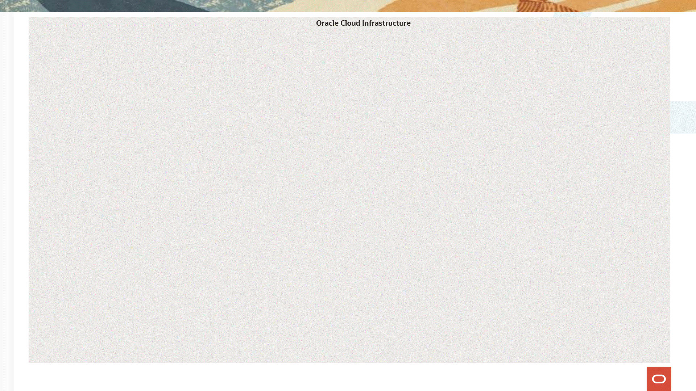

# Arquitetura Medalhão com Oracle AI Data Platform

## Resumo

A **arquitetura de medalhão** é um modelo que organiza os dados em etapas progressivas — **Bronze, Prata e Ouro** —, facilitando a jornada de **dados brutos até insights de alto valor**. Essa estrutura garante **qualidade, rastreabilidade e confiabilidade**, permitindo que as empresas tomem decisões mais seguras e que modelos de **Inteligência Artificial** sejam alimentados com dados consistentes.

Dentro dessa jornada, o **Oracle AI Data Platform (AIDP)** será o coração da arquitetura medalhão, unindo **processamento em escala com Apache Spark**, **governança centralizada** e **integração com BI e IA**. Ele transforma dados brutos em insights acionáveis com segurança, colaboração e eficiência, garantindo **produtividade e escalabilidade** em todo o ciclo de vida dos dados.

![Essa imagem indica uma visualização do Oracle AI Data Platform, mostrando no Master Catalog a tabela customers, localizada na camada bronze (bronze_layer > crm), que armazena perfis de clientes com cinco colunas: userid (identificador do cliente), city (cidade), state (estado), accountage (tempo de conta) e premiummember (indicação se é membro premium); à esquerda, o painel evidencia a arquitetura em camadas do Lakehouse (bronze, silver e gold), organizada para acompanhar a evolução dos dados ao longo do ciclo de vida.](images/oci-aidp.png)

Nos tópicos a seguir, você poderá explorar em detalhe como essa arquitetura está estruturada e como cada camada contribui para gerar valor.

### *Sobre esse Workshop*

O laboratório tem como objetivo desenvolver habilidades no uso de serviços de Lakehouse da Oracle Cloud, cobrindo desde a aquisição de dados até a geração de insights e relatórios. A metodologia segue a arquitetura em camadas Bronze, Prata e Ouro, permitindo que os participantes explorem e refinem os dados em cada fase do ciclo de vida.

**Todas as práticas estão descritas em detalhes e não necessitam de qualquer conhecimento prévio para serem executadas.**

Em caso de dúvidas ou necessidade de suporte, os participantes poderão entrar em contato com a equipe responsável pela criação e edição dos laboratórios, com informações de contato disponíveis ao final de cada etapa.

***Tempo estimado para o Workshop:* 3 Horas**

*Objetivos*

Por meio deste guia, iremos fornecer laboratórios práticos de:

* Configuração e Implementação do Ambiente no **AIDP**
* Organização e Governança de Dados no **AIDP**
* Manipulação e Transformação de Dados no **AIDP**
* Consumo de Dados via **Oracle AI Data Platform**
* Visualização de Dados no **Oracle Analytics Cloud (OAC)**

## Arquitetura do Workshop

### *Sobre o Oracle Cloud Infrastructure Data Flow*

O **OCI Data Flow** será o **principal serviço** utilizado neste workshop. Ele é uma **plataforma em nuvem para análise de dados** que simplifica o uso do **Apache Spark em grande escala**.

Por estar **totalmente na nuvem**, elimina a necessidade de **configurar e manter clusters**, permitindo que desenvolvedores e cientistas de dados foquem no que realmente importa: **processar e transformar informações**.

Com o **Data Flow**, é possível:

* **Executar tarefas em paralelo**, aproveitando o poder distribuído do Spark.
* Fazer **análises de big data diretamente nas fontes**, sem complicações de infraestrutura.
* **Integrar facilmente** a ferramenta a fluxos de trabalho existentes, pela **interface intuitiva** ou por **APIs**.
* **Processar dados em tempo real** com Spark Streaming, garantindo informações sempre atualizadas para análises e decisões rápidas.

Em resumo, o **OCI Data Flow une escala, simplicidade e eficiência**, ajudando a **transformar dados em valor** sem a sobrecarga de gerenciar infraestrutura.

## Saiba Mais

Aqui estão os links atualizados para a Oracle AI Data Platform (AIDP):

**Inglês:**

* [Página oficial do AIDP](https://www.oracle.com/br/ai-data-platform/)
* [Documentação do AIDP](https://docs.oracle.com/pt-br/iaas/goldengate/doc/connect-oracle-ai-data-platform1.html)

## 👥 Autoria

- *Created By/Date* - Isabelle Anjos, Outubro 2025
- *Last Updated By* - Isabelle Anjos, Outubro 2025

## 🛡️ Declaração de Porto Seguro (Safe Harbor)

O tutorial apresentado tem como objetivo traçar a orientação dos nossos produtos em geral. É destinado somente a fins informativos e não pode ser incorporado a um contrato. Ele não representa um compromisso de entrega de qualquer tipo de material, código ou funcionalidade e não deve ser considerado em decisões de compra. O desenvolvimento, a liberação, a data de disponibilidade e a precificação de quaisquer funcionalidades ou recursos descritos para produtos da Oracle estão sujeitos a mudanças e são de critério exclusivo da Oracle Corporation.

Esta é a tradução de uma apresentação em inglês preparada para a sede da Oracle nos Estados Unidos. A tradução é realizada como cortesia e não está isenta de erros. Os recursos e funcionalidades podem não estar disponíveis em todos os países e idiomas. Caso tenha dúvidas, entre em contato com o representante de vendas da Oracle. 
